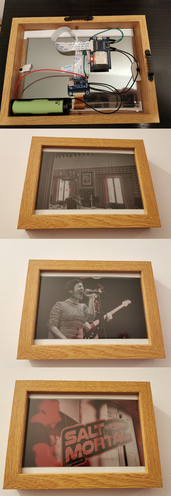
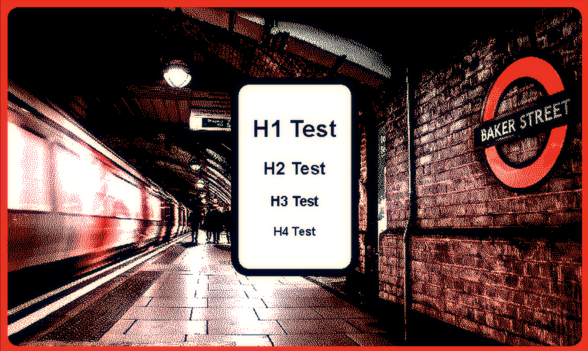

# Web2Ink - Paper Portals

This node.js service can be used to display webpages on e-paper/ink display devices.
Essentially, you can consider this as an HTML rendering service for microcontrollers.

The service captures a screenshot of a webpage and converts it into a compact 8bpp BMP using customizable dithering and a customizable color palette.

This can be useful if the display is driven by a device less powerful, such as an ESP32, as opposed to a Raspberry Pi.

Data from sensors, such as temperature, can be sent to the target page via URL to be rendered in HTML.

By default, the color palette is Black, White, Red.
The color can be matched to your display and can support up to 255 colors.

Use "-webkit-font-smoothing: none;" in your webpages to disable font anti-aliasing for sharper rendering.

Example of calling the web service:
http://myserver:3000/?auth=changeme&url=http://myserver:3000/test/

Here is an example of an 800x480 Red, Black, and White ePaper frame, driven by Waveshare ESP32. It calls the service using an HTTP call and displays the results using
[GxEPD2](https://github.com/ZinggJM/GxEPD2) driver:

