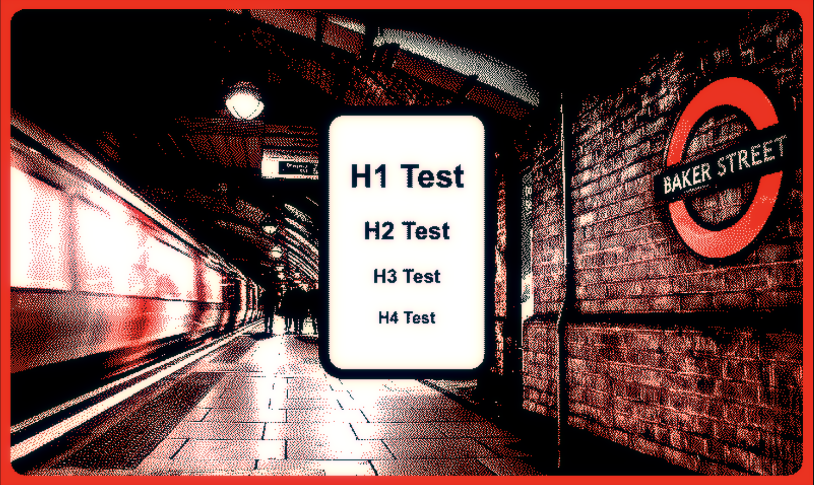

# Web2Ink

This node.js service can be used to display webpages on EDP ink devices.

The service captures screenshots of a webpage and converts them into compact 8bpp BMPs using dithering and a customizable color palette.

This can be useful if the EFP device is driven by a device with small memory. Additionally, you can create a color palette that matches your device. By default, the color palette is Black, White, Red.

